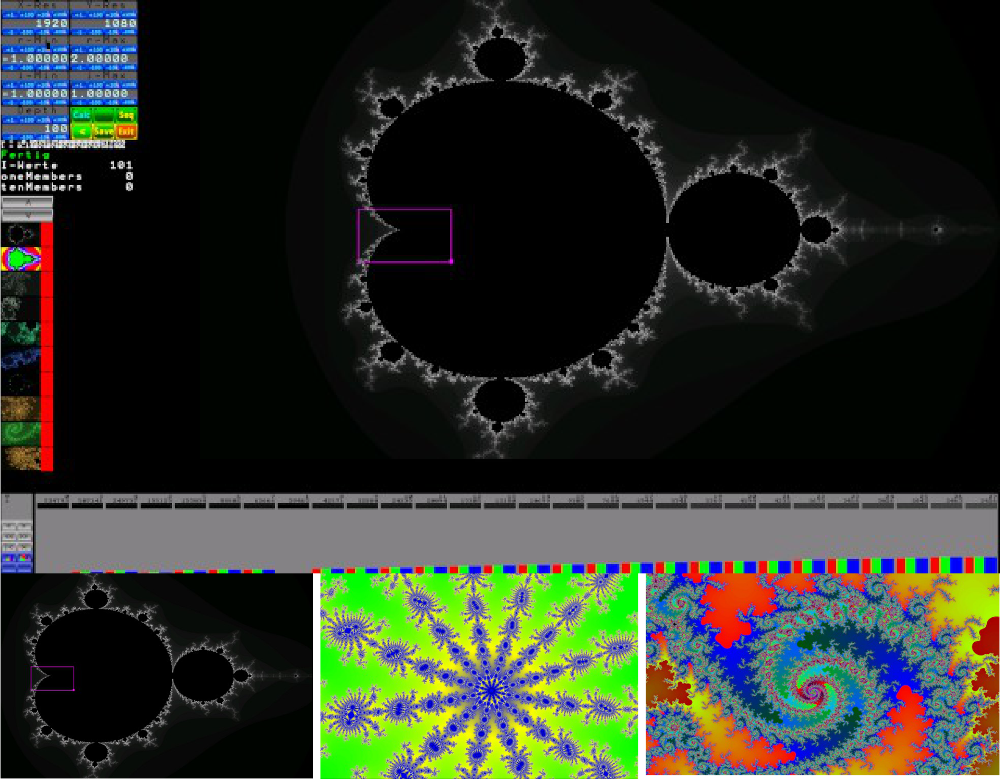

**Fraktalgenerator nach Mandelbrodt**

Edit:\
Das Programm enthält eine, hier nicht weiter dokumentierte
Serienaufnahme-Funktion die alle Apfelmännchen mit einem Depth-Wert bei 1 beginnend, bis zu im Programm
bereits berechneten Depth-Wert und der anderer Parameter berechnet und deren BMP-Bilddateien im Ordner „bmp"
speichert. Der Button „Seq" startet die recht zeitaufwendige Prozedur.
Doch danach können mittels „ffmpeg" interessante Videos der Änderung der Mandelbrodtmenge über die
Iterationstiefe erstellt werden.

**Wichtig:** Zum Start der Anwendung muss das „start.sh"-Script mit
sudo-rechten aufgerufen werden

Fraktale nach Mandelbrodt sind Selbstähnliche Strukturen welche mit
diesem Programm, in Abhängigkeit der Iterationstiefe gefärbt und als
BMP-Bilddatei gespeichert werden können. Zur Bedienung des Programms
werden Begriffe gebraucht die im Folgendem erörtert sind.

> Bild oben: **Wichtig** Die Zahlenwerte
> haben eine Überschrift und können mit je vier Buttons darüber in
> Schritten erhöht, und vier Buttons darunter gesenkt werden. Änderungen
> müssen mit Klick auf „Calc" neu berechnet/abgebildet werden.

**Zoomen**
Wir „zoomen in das Apfelmännchen in dem wir den kleinen magentafrbenen
„Maus-Quader" des Programms, durch Drücken und Halten der linken
Maustaste den Startpunkt und durch bewegen der Maus zum Endpunkt, diese
Punkte mit einem zusätzlichen rechten Mausklick festlegen. Das Programm
beginnt unmittelbar mit der Neuberechnung\
**Wichtig**: Die interessanten Teile des Apfelmännchen sind die Ränder

**X-Res und Y-Res**
Diese Parameter legen die Auflösung des zu berechnenden Apfelmännchen
fest in der es auch als Bild gespeichert wird, aber nicht unbedingt die
im Programm dargestellte. Das Programm skaliert das Apfelmännchen so das
es vollständig zu sehen ist. Beim Start des Programms sind diese immer
gleich der Monitorauflösung. Um eine eventuell gewünschte mathematisch
genaue Abbildung des Apfelmännchens zu erreichen ist hier ein 3 zu 2
Format zu wählen.

**r-Min/Max und i-Min/Max**
Diese Parameter sind zur Bedienung des Programms nicht nötig und
überspringbar\
Die Abbildungen der Apfelmännchen-Struktur errechnen sich durch
Zahlenpaare zwischen den r/i-min/max Werten welche den X/Y-Achse des
Apfelmännchen zugeordnet werden. Der Symmetrie des Apfelmännchen und des
Algorithmus wegen, geben die Startwerte dieser Parameter nur Sinn wenn r
zwischen einschließlich -1 und +2 sowie i zwischen -1 und +1 liegen.
Wenn wir diese Werte ändern verschieben wir tatsächlich den Ursprung der
Koordinaten innerhalb des Apfelmännchen, und ändern diese Parameter
besser durch das Zoomen. Wer experimentieren will kann die Asymmetrie
durch ändern der i/r-min/max Werte von Hand, am besten direkt nach dem
Start des Programms berechnen und abbilden lassen

**Depth**
Das im oberen Bild zu sehende SW-Apfelmännchen entsteht durch
Grauabstufung in Abhängigkeit davon, wie oft ein Algorithmus auf den
Bildpunkt angewendet werden muss bis dessen Ergebnis eine
Abbruchbedingung erfüllt. Diese Anzahl an Wiederholungen bezeichnen wir
hier als Iterationstiefe. Der Algorithmus ist im Anhang detailliert
beschrieben und hier Überflüssiges, denn zum Verständnis genügt es zu
wissen das jedem Bildpunkt eine Iterationstiefe zugeordnet ist, welche
die Farbe oder Intensität des Bildpunktes bestimmt. Den Depth-Wert den
wir im Programm vorgeben, legt den Maximalwert an
Iterationen/Wiederholungen des Algorithmus fest der über die Bildpunkte
ausgeführt wird, und die Farbe der Bildpunkte legen wir anschließend
anhand deren Iterationstiefen fest. Erhöhen wir den Startwert Depth von
100 auf 500 und klicken auf „Calc", haben wir in weniger als einer
Sekunde einen Eindruck der graphischen Wirkung in Schwarzweiß.

**Farbgestaltung**
Um die Farbgestaltung zu verstehen, stellen wir uns die Iterationstiefen
als Zahlenstrahl von Null bis zu unserem vorgegeben Depth-Wert mit
Lücken vor, dem wir die Menge aller Bildpunkte zuordnen. So sind der
Zahlenstrahl und Iterationstiefe 1 alle Bildpunkte zugeordnet die nach
einmaliger Ausführung die Abbruchbedingung erfüllten, und der zwei alle
Bildpunkte die nach zweimaliger Ausführung die Abbruchbedingung
erfüllten und so fort. Die Iterationstiefe 0 entspricht schwarz und je
höher diese desto heller der Punkt nach dem Start des Programms. Schwarz
bedeutet das der Bildpunkt bis zum Depth-Wert die Abbruchbedingung nicht
erfüllt hat.

**Farbgeber**
Das Programm bietet für jede Iterationstiefe einen RGB-Farbgeber, mit
dem die Farbe aller Bildpunkte welche der Iterationstiefe entsprechen
vorgegeben werden kann. Wichtig zu wissen das die obere der beiden
türkisfarben markierten Zahlen im Bild die Iterationstiefe, und die
untere die Anzahl an Bildpunkten zeigt welcher dieser Iterationstiefe
entsprechen.

Bild:\
Drei vollständig und ein teilweise zu sehender Farbgeber. Links im Bild
die Navigations- und Befehlsbuttons der Farbgebung

Da die Menge an Farbgebern meist nicht in einem Satz sichtbar ist, zeigt
die obere Zahl im gelb markierten Bereich den aktuell angezeigten Satz
und die Untere die Anzahl an Farbgeber-Sätzen an.

Die Pfeilbuttons dienen der Navigation innerhalb der Sätze. Die Farbe
kann durch ziehen der Farbbalken im Farbgeber mit der Maus eingestellt
werden und wird im waagerechten Balken unter der Anzahl an Bildpunkten
dargestellt. Ein Klick auf diesen Querbalken färbt die Zahlen weis und
zeigt somit an, das dieser Farbgeber einen Festen Wert innerhalb eines
zu erstellenden\
Farbverlaufes zwischen mindestens zwei solcher markierten Farbgebern
ist. Diesen können wir mit einem Klick auf den linken Button im
magentafarben markierten Bereich des Bildes erstellen. Der rechte Button
dient der Übertragung der in den Farbgebern eingestellten Farben auf
das\
Apfelmännchen. Die Implementierung des Farbverlaufs zwischen den
Farbgeber ist nicht vollständig durchdacht, so das hier Experimentieren
vorausgesetzt wird (der Wert jeder zu ändernden Farbe des Verlaufs
sollte größer null sein im Farbgeber und die Verläufen sollten drei
Sätze nicht überschreiten sowie von links beginnend nach rechts
nacheinander übertragen werden) Mit einem Klick auf die Zahlen des
Farbgebers werden die RGB-Werte dessen zu 0.

Im Anhang „Code-Einsprungpunkt" wird auf eine Zeile im Quelltext
verwiesen, dessen Änderung eine Verschiebung des Schwarz-weißen
Apfelmännchens innerhalb des Spektralbereich ermöglicht, und als
Einsprungpunkt algorithmischen Farbgebungs-Codes dient, dessen\
Spezifikation(Parameter?,Ziel?) durch Umgang mit den Farbgebern des
Programms erdacht werden kann.

**Speichern der Apfelmännchen**\

Mit einem Klick auf „save" wird
ein BMP-Bild des Männchens mit der Zeit als als Namen im Ordner „bmp"
der Programmdatei abgelegt.
Gleichzeitig wird das
Apfelmännchen mit seinen
Farbgebern in der Leiste wie 
sie im Bild links zu sehen ist,
gespeichert und kann durch klicken auf das kleine Abbild
aufgerufen werden. Ein Klick
auf die rote Fläche neben dem
Abbild löscht das gespeicherte
Apfelmännchen.

**Sortierergebnisse**
> 

***r und i***\
Wenn wir uns mit dem „Maus-Quader" über dem Apfelmännchen befinden,
zeigen uns r und i das zum Bildpunkt gehörende Zahlenpaar des
Algorithmus an

***Fertig***\
Da Berechnungen mit großen Depth-Werten länger als gewohnt dauern und
das Programm keinen Fortschritt darstellt und die Eingabe blockiert ist,
erscheint während laufender Berechnung hier „Rechne" in rot

***I-Werte***\
Ist die Anzahl der Iterationstiefen die über alle Bildpunkte gefunden
wurde, einschließlich schwarz.

***oneMembers***\
Ist die Anzahl der Iterationstiefen welche nur ein Bildpunkt entspricht

***tenMembers***\
Anzahl der Iterationstiefen welche weniger als elf Bildpunkte
entsprechen (inklusive oneMember).

Im Anhang „Sortierwerte" diesen Dokuments wird der Programmcode
aufgezeigt ,welcher durch Zahlenänderung die Ergebnisse one/tenMember
mit anderer Anzahl an Bildpunkten errechnen lässt.

**Anhang**
***Mathematische Beschreibung***

*Depth*=*Maximale Iterationsanzahl b*∈ℕ∖0 \
*X*−*Res*= Anzahlder Bildpunkte der x*−*Achse m*∈ℕ∖(0,1)
Minimaldes Realanteils der Zahlenebene rmin*∈ℚ (gewöhnlich −1)
Maximal des Realanteilsder Zahlenebene rmax*∈ℚ (*gewöhnlich* 2)
>
> *Y* −*Res*=*Anzahlder Bildpunkteder y*−*Achse n*∈ℕ∖(0,1)
>
> *Minimaldes Imaginäranteilsder Zahlenebene imin*∈ℚ (*gewöhnlich* −1)
>
> *Maximal des Imaginäranteilsder Zahlenebene imax*∈ℚ (*gewöhnlich* 1)
>
> *X* :={*Bildpunkteder x*−*Achse*}⊂ℚ\
> *x*0∈*X* ∧*x*0=*rmin*\
> −1 *xm*∈*X* ∧*xm*=*f x*(*xm*−1):→*xm*=*xm*−1+(*rmax*−*rmin*)(*m*−1)
>
> *Y* :={*Bildpunkte der y*−*Achse*}⊂ℚ\
> *y*0∈*Y* ∧*y*0=*imin*\
> −1 *yn*∈*Y* ∧*yn*=*f y*( *yn*−1):→*yn*= *yn*−1+(*imax*−*imin*)(*n*−1)
>
> *C*⊂ℂ∧*C*:= *X*×*Y*\
> *cmn*∈*C* →*cmn*:=(*xm*∣*yn*)

(*i*0*,r*0)∈ℝ∧*i*0*,r*0:= 0\
*v*0∈ℂ∧*v*0:=(*r*0∣*i*0)

> *v z*∈ℂ∧*v z* =: *f v*(*vz*−1)→*v z*= (*v z*−1) 2−*cmn*
>
> (*berechnungshinweis* )
>
> *vz* =(*r z*∣*iz*)=(*rz*−1∣*iz*−1) 2−*cmn*
>
> *r z* = (*r z*−1) 2−(*iz*−1) 2−*xm*\
> *iz* = *r z*−1*iz*−1 +*\' r z*−1*iz*−1 −*yn*
>
> *k z*∈ℚ∧*k z* := (\|*v z*\|) 2=(*rz*) 2+(*iz*) 2
>
> *amn*∈ℕ0∧*amn*=: *f k*(*k z*)→{ 0 : *k z*\<4 ∧*z*\<*b*} *z* : *k z*≥4
>
> *amnist die Anzahlder Iterationenbiszur Abbruchbedingung ,*\
> *nachwelcher die Helligkeit oder Farbe desBildpunktes festgelegt wird*
>
> Seite 6

***Die Funktion zur Berechnung der Iterationstiefe in der
Programmiersprache c***

int amn(double xm, double yn, int b){\
double r = 0;\
double i = 0\
double array\[\] = {0, 0, xm, yn};\
int count = 0;\
while(count \< b){\
count++;\
r = array\[0\]\*array\[0\] - array\[1\]\*array\[1\] -- array\[2\]; i =
array\[0\]\*array\[1\] + array\[0\]\*array\[1\] -- array\[3\]; if
((r\*r + i\*i) \>= 4){\
return count;\
}\
array\[0\] = r;\
array\[1\] = i;\
}\
return 0;\
}

***Code-Einsprungpunkt***

Durch Auskommentieren der Zeile 52 im Programmcode /include/\_Apple.cpp
und aktivieren der darauf folgenden Codezeile 54, so wie anpassen der
drei Faktoren der RGB-Werte und anschließender Neukompilierung, lässt
sich das Schwarzweise Apfelmännchen farblich verändern.

47 static void \*thrFunc(void\* val){

48 int \*x = (int\*)val;

49 for(int y=0; y\<thr_yres; y++){

50 thr_matrix\[\*x\]\[y\] = getIterCount(thr_rmin+(\*x)\*delta_r,
thr_imin+y\*delta_i, thr_depth);

51 double div = (255.0/thr_depth) \* thr_matrix\[\*x\]\[y\];

52 int color = (int)div\<\<16 \| (int)div\<\<8 \| (int)div;

53 // hier koennen die Farben zu den Spektren hin verschoben werden

54 // int color = (int)(div/3\*3)\<\<16 \| (int)(div/4\*1)\<\<8 \|
(int)div/4\*1;

55 thr_colors\[\*x\]\[y\] = color;

56 }

57 return NULL;

58 }

Seite 7

***Sortierwerte***\
In den Codezeilen 133 und 135 der /include/\_Apple.cpp können die
Grenzwerte zur Ermittlung zugehöriger Bildpunkte direkt geändert und
anschließend neu kompiliert werden.

133 if(iterMembers\[i\]\[1\] \< 2){\
134 oneMembers.push_back(iterMembers\[i\]\[0\]);} else
if(iterMembers\[i\]\[1\] \< 11){ 135\
135 tenMembers.push_back(iterMembers\[i\]\[0\]);}

Seite 8
